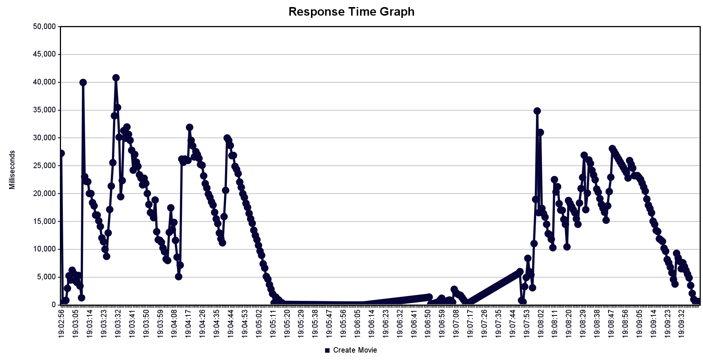

# 1st Part

- [x] Base de datos

Usamos postgres :)

- [x] Api swagger

http://localhost:8080/redoc

- [x] Code coverage 90%

coverage run -m pytest

coverage report --show-missing

Tenemos 91% :)

- [x] Endpoint con happy path latency < 1000ms

Endpoints tienen < 10ms

- [x] 400 y 500 documented

http://localhost:8080/redoc

- [] Integration test con base

- [x] Availability 95%

Archivos CSV en jmeter/availability/

Entre los 3 endpoints, hicimos 80k requests, y tuvimos errores en 5k.

(80k / 5k) * 100 = 93.75% de availability :(

- [x] Reliability 95%

Archivos CSV en jmeter/reliability/

Los report summaries demuestran una tasa de error del 0% para usuarios individuales, por lo que el api hace lo que se espera

# 2nd Part

- [x] Técnica: Performance testing

Elegimos stress testing, para ver la carga necesaria para que se caiga el api :)

La primera sección con picos altos es un test con 10k usuarios por segundo. El api murio casi de forma inmediata. La parte baja del medio es un test con 5k por segundo, carga que nuestro API puede soportar. El ligero incremento luego de eso es el test con 6k usuarios, y por útimo, el primer pico de la parte final es el inicio del testing con 7k usuarios.

Podemos ver que si vamos en incrementos de mil usuarios, nuestro api soporta hasta 6000 requests por segundo.

- [x] Combinación CAP:

La combinación elegida para el proyecto es AP. No elegimos Consistency, ya que la data que se utiliza no es crítica para el funcionamiento óptimo del sistema. La descripción de algunas películas puede ser incorrecta, e incluso los título también, pero el servicio de streaming (el cual estaría separado), no dependeria de esta información.

Elegimos Availability porque al ser un servicio con alta concurrencia de usuarios, es necesario asegura el funcionamiento correcto del API incluso bajo alto tráfico de usuarios. (7K por segundo no está nada mal)

Por último, se escogió Partition Tolerance. En un contexto real, este API es sólo una parte toda una aplicación de películas, por lo que el servicio debería seguir funcionando sin depender de otros servicios. Si se cae el servicio de streaming, el servicio de recomendación debería seguir operativo.

- [] Agregar logs a un endpoint y guardar en txt

- [] Enviar 1k requests al endpoint con logs

- [] Hacer scripts que parsee logs en un rango de fechas y devuelva la cantidad d éxitos y fallas